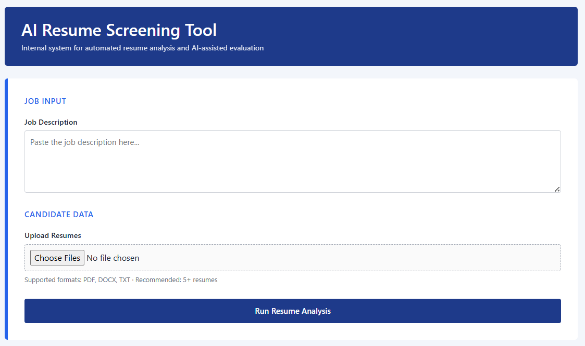
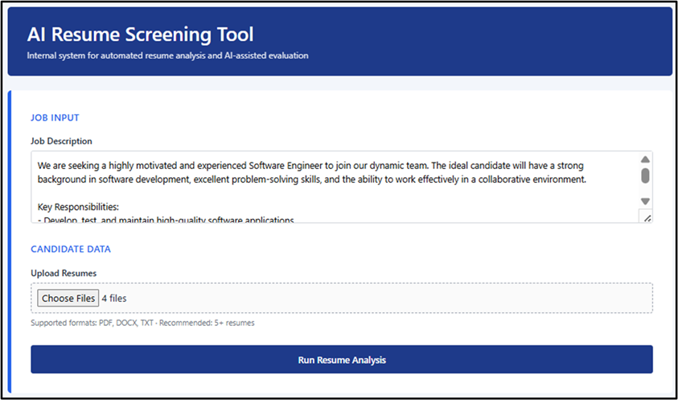
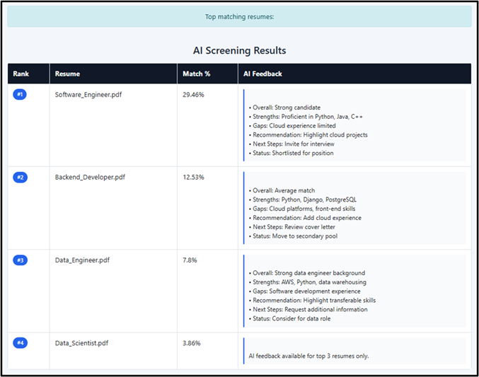

# **AI Resume Screening System**

## **Project Overview**

The AI Resume Screening System is a web-based application designed to simplify and improve the resume evaluation process. It allows recruiters to upload multiple resumes and compare them with a given job description. The system ranks resumes based on similarity and provides AI-generated professional feedback to support better hiring decisions.

This project combines Machine Learning techniques with Generative AI to create a structured and efficient resume screening process.

---

## **Key Features**

- Upload multiple resumes (PDF, DOCX, TXT)
- Enter custom job descriptions
- Automatic similarity scoring using TF-IDF and Cosine Similarity
- AI-generated feedback using LLaMA-3.3-70B-Versatile
- Ranked list of top matching resumes
- Clean and user-friendly interface

---

## **Application Screenshots**

### **1. Resume Screening Form**

---

### **2. Filled Form with Job Description and Resumes**

---

### **3. Top Matching Resume Results**

---

## **Technologies Used**

- Python  
- Flask (Backend Framework)  
- HTML, CSS, Bootstrap  
- Scikit-learn (TF-IDF & Cosine Similarity)  
- PyPDF2 & docx2txt  
- LLaMA-3.3-70B-Versatile  
- GROQ API  

---

## **How the System Works**

1. The recruiter enters the job description.
2. Multiple resumes are uploaded.
3. The system extracts text from resumes.
4. TF-IDF and Cosine Similarity calculate match percentages.
5. Resumes are ranked based on similarity.
6. Top resumes are evaluated using the LLaMA model.
7. AI-generated feedback is displayed along with ranking results.

---

## **Project Objective**

The objective of this project is to reduce manual effort in resume screening and provide a more structured and intelligent candidate evaluation process.
